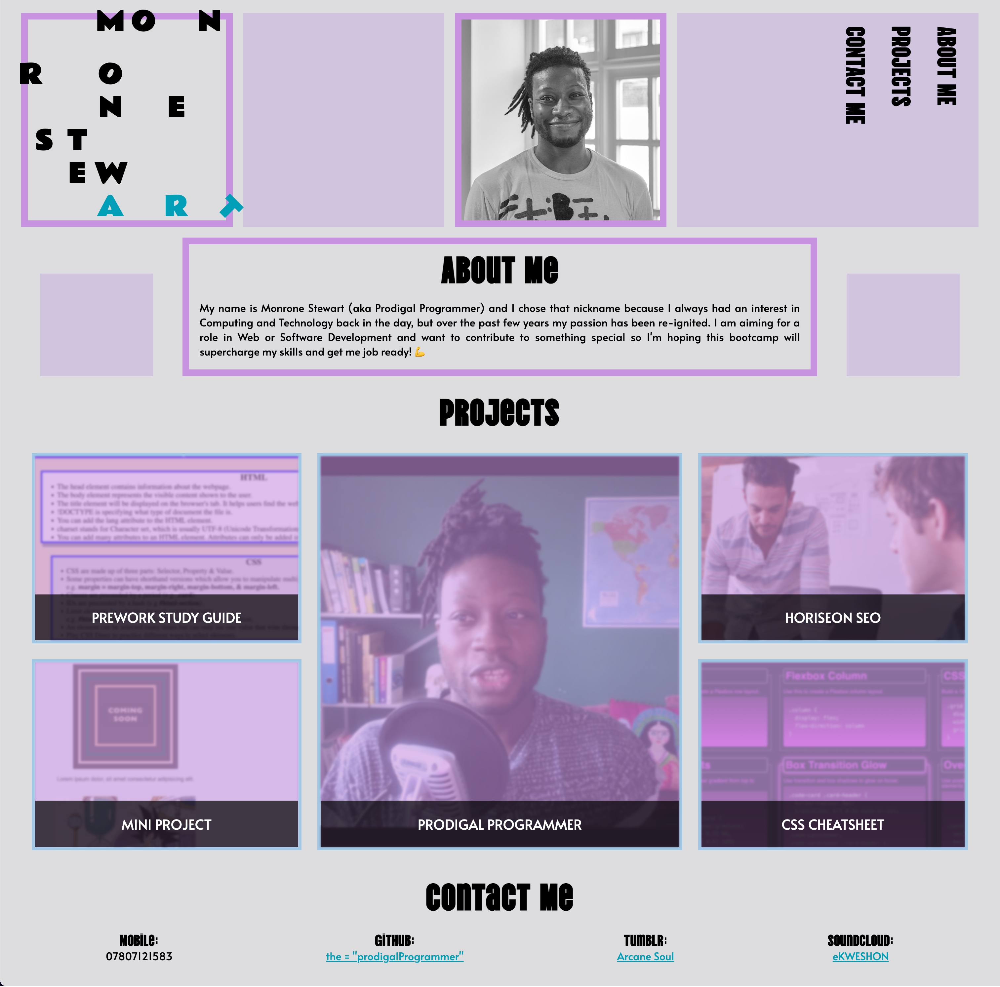

# My Portfolio

<details>
<summary>Table of Contents</summary>
<ol>
<li><a href="#description">Description</a></li>
<li><a href="#usage">Usage</a></li>
<li><a href="#features">Features</a>
<ul>
<li><a href="#root">:root</a></li>
<li><a href="#header-section">Header</a></li>
<li><a href="#main-section">Main</a></li>
<li><a href="#footer-section">Footer</a></li>
</ul>
</li>
<li><a href="#license">License</a></li>
<li><a href="#contact">Contact</a></li>
<li><a href="#acknowledgement">Acknowledgement</a></li>

</ol>
</details>

<a href="https://prodigalprogrammer.github.io/portfolio/"></a>

## Description

A Portfolio for all the projects Monrone has made so far. This site was created with only HTML & CSS, so not very complicated to reproduce.

_Find the link to the the deployed website [here](https://prodigalprogrammer.github.io/portfolio/)_

<p align="right">(<a href="#my-portfolio" >Back to top</a>)</p>

## Usage

Scroll through the website to find out more information on Monrone Stewart, with projects that you can select to be taken to the relevant GitHub page. There is also a contact section of links to various sites pertaining to Monrone.

<p align="right">(<a href="#my-portfolio" >Back to top</a>)</p>

## Features

### `:root`

- CSS Variables has been used throughout the website. I used the `rgb()` value to incase the variables so I can use opacity value as well.

### `header` section

- #### Name Logo

  - The letters in the logo have when spread across the `grid` structure to give the name a puzzle type effect.
  - When hovered over, the letters move around to create two new words using the `transform: translate` and `color` properties on the `:hover` pseudo-selector.
  - The other black coloured letter change to white when hovered over.

- #### Profile Image

  - Image is the same size as the logo so it looks uniform with the website.
  - Image is shifted to the side of the grid structure using `justify-self: end`.
  - Image moves alongside logo when the screen size increases.

- #### Empty `div` box

  - Box has a `background-color` that matches the theme of website, and increases with the screen width using `flex-grow: 0.5` to insure it grows half as much than the navigation bar.

- #### `nav` section

  - Navigation bar is inline with the logo in mobile mode.
  - Links change white when hovered over.
  - Links 'bounce' when hovered over.
  - Navigation bar shifts to `writing-mode: vertical-rl` when the screen size width increases to over 1048px.

<p align="right">(<a href="#my-portfolio" >Back to top</a>)</p>

### `main` section

- #### Empty `div` elements

  - There are more coloured boxes adjacent to the About Me box that are animated to manipulate the height. The `div` elements start with a height of 5%, then increases to full height at the 45-55 percentile, before moving back to 5% height. The animation lasts for three seconds, and repeats forever. Here is the following code that allows this to function:

```css
.about-spaceBox {
  background-color: rgb(var(--thistle));
  justify-self: center;
  align-self: end;
  width: 75%;
  height: 5%;
  animation: shift 3s infinite;
}

@keyframes shift {
  45%,
  55% {
    height: 100%;
  }
}
```

- #### About Me box

  - Has a border that blends with the rest of the website.
  - There is an emoji featured at the end of the text using `HTML` code.
  - In the mobile version, the About Me box is aligned with profile image to give the website a staggered layout.

- #### Projects section
  - The projects have a blur and opacity effect as default.
  - When hovered over, the projects will become clearer and have the `border` change colour with a nice `box-shadow` effect.
  - The `figure` tag was used inside the `anchor` tag to create a border around the project boxes.
  - Once the screen width increases, the projects will move around the webpage to accomodate the extra space.

### `footer` section

- #### Contact Me
  - There are four list items, and three are links that display another colour.
  - When the links are hovered over, they change colour to white.
  - Mobile View: Footer list is `flex-direction: column` having them stack up on top of each other.
  - Tablet & Desktop View: `flex-direction`'s value changes to `row` and grows with the width of the screen.

<p align="right">(<a href="#my-portfolio" >Back to top</a>)</p>

## License

Distributed under the MIT License. See `LICENSE.txt` for more information.

<p align="right">(<a href="#my-portfolio" >Back to top</a>)</p>

## Contact

Project Link: [https://github.com/prodigalProgrammer/portfolio](https://github.com/prodigalProgrammer/portfolio)

Monrone Stewart: [YouTube](https://www.youtube.com/@ProdigalP) - prodigalprogrammer7@gmail.com

<p align="right">(<a href="#my-portfolio" >Back to top</a>)</p>

## Acknowledgement

- [GitHub Pages](https://pages.github.com/)
- [Jen Simmons](https://jensimmons.com/)
- [Coolers](https://coolors.co/)
- [CSS Tricks](https://css-tricks.com/)
- [Google Fonts](https://fonts.google.com/)
- [HTML Standard](https://html.spec.whatwg.org/multipage/sections.html)
- [HTML Icons](https://symbl.cc/en/)
- [README Template](https://github.com/othneildrew/Best-README-Template/blob/master/README.md)
- [CSS Diner](https://flukeout.github.io/)
- [Flexbox Defense](http://www.flexboxdefense.com/)

<p align="right">(<a href="#my-portfolio" >Back to top</a>)</p>
````
